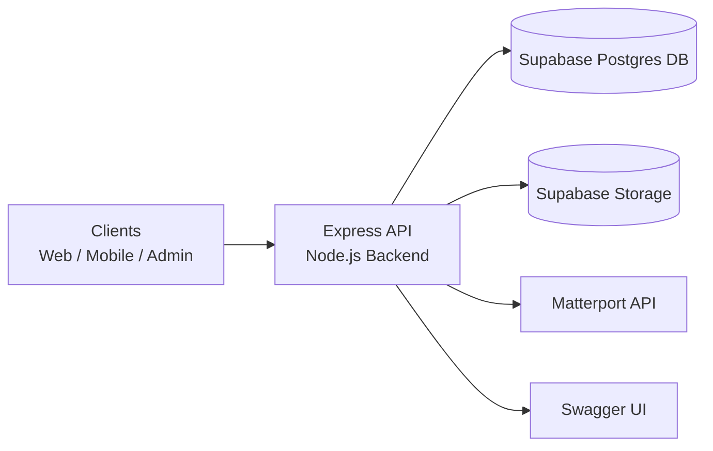

# Architecture Context

## Data flow (short description)

### 1) Task creation
1. The client sends a request to the Express API (for example with `location_id`, `activity_id`, `description`).
2. The Express API validates the payload and writes the record to the `tasks` table (Supabase DB).
3. Optionally, the API creates derived records (for example `notifications`) for related entities.
4. The API returns the created task to the client.

### 2) Document upload with signed URL
1. The client requests an upload signed URL from the Express API.
2. The API creates a time-limited signed URL via Supabase Storage and returns it.
3. The client uploads the file directly to Supabase Storage (without streaming file content through the API).
4. Then the Express API stores metadata (for example `file_url`, `task_id`, `user_id`) in `documents` in the Supabase DB.

### 3) Matterport sync
1. The Express API calls the Matterport API to read external room/tag information.
2. The API maps the data to local entities (`floors`, `rooms`, `locations`).
3. Changes are persisted in the Supabase DB (insert/update, and optional deactivation of tags no longer present).
4. The client receives the synchronized dataset through regular API endpoints.
