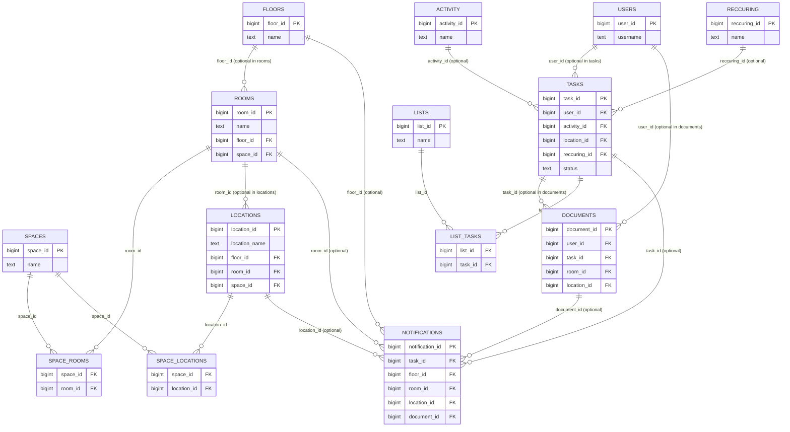

# ER Model v1

## Legend

- **Required FK (NOT NULL):** The foreign key column in the child table is mandatory. In this schema, this applies to the join tables `space_rooms`, `space_locations`, and `list_tasks`.
- **Optional FK (NULL allowed):** The foreign key column in the child table is optional. In this schema, this applies to columns such as `rooms.floor_id`, `locations.room_id`, `tasks.user_id`, `documents.task_id`, and all FK columns in `notifications`.
