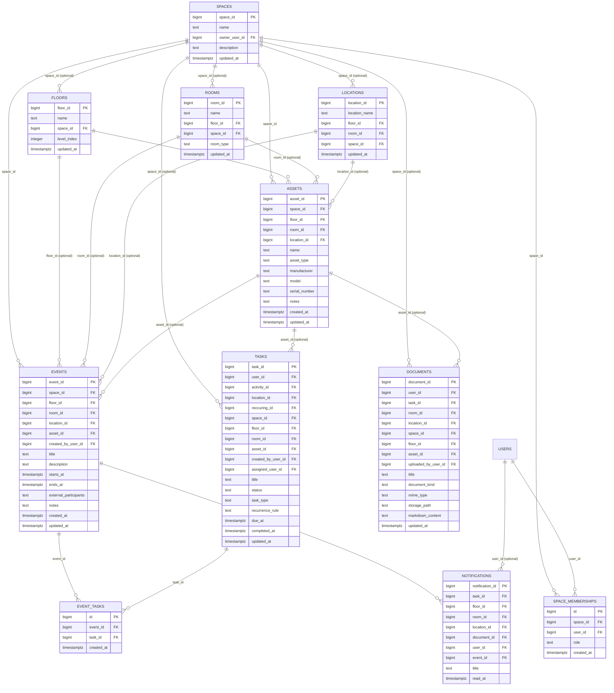

# ER Model v2

This diagram extends the v1 schema with the tables and columns added by the v2 migration (`20260306000001_v2_additive_schema.sql`). Only the additions and changed tables are shown; unchanged v1 tables are omitted for clarity.

## Legend

- **New tables in v2:** `assets`, `events`, `event_tasks`, `space_memberships`
- **Extended tables:** `spaces`, `floors`, `rooms`, `locations`, `tasks`, `documents`, `notifications`
- All new FK columns are optional (NULL allowed) unless marked otherwise.
- `event_tasks` and `space_memberships` enforce uniqueness via `UNIQUE(event_id, task_id)` and `UNIQUE(space_id, user_id)` respectively.
